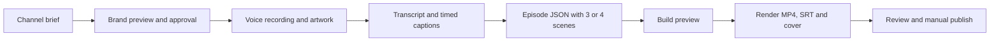
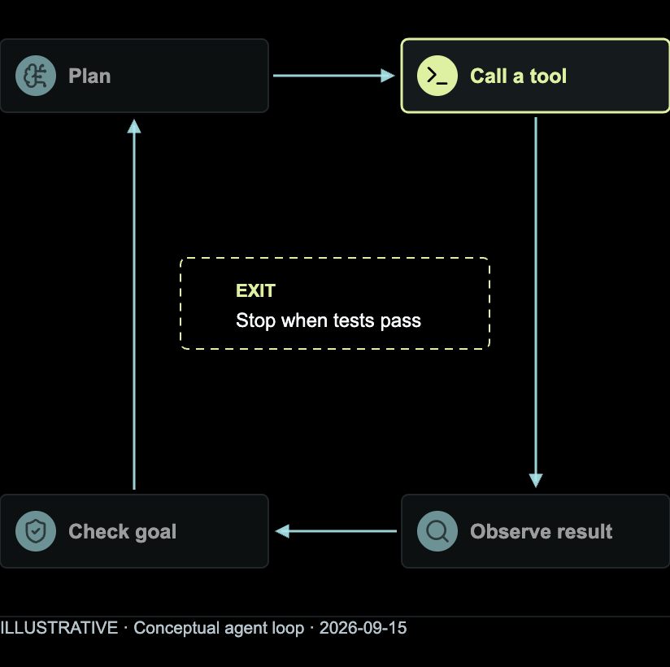
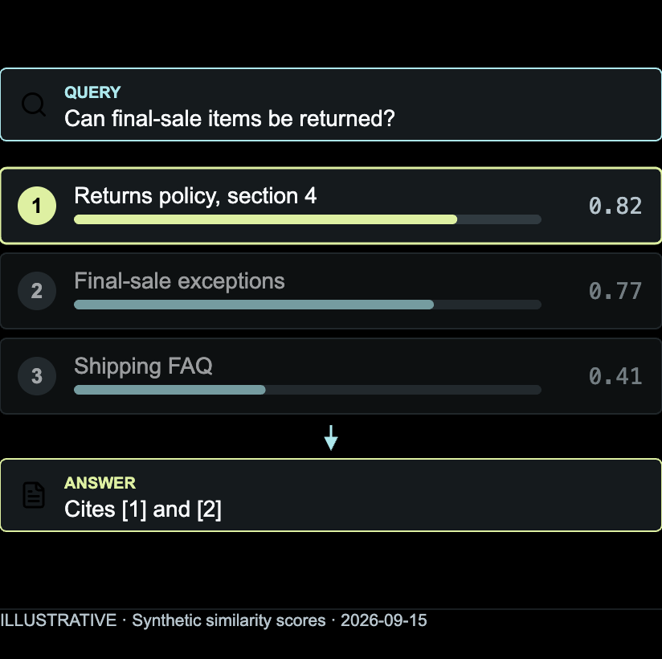
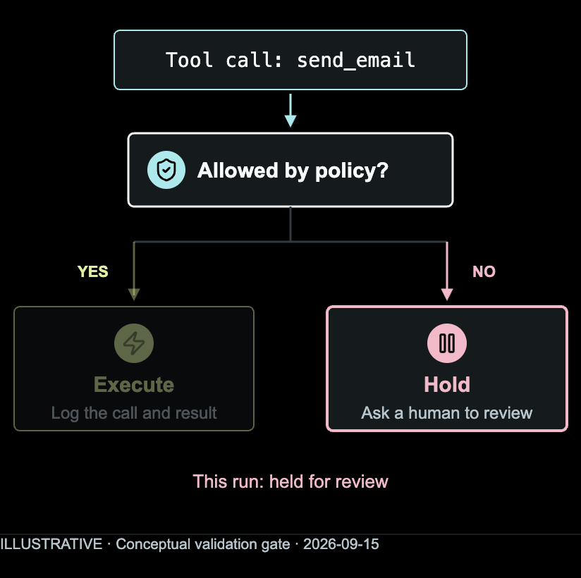
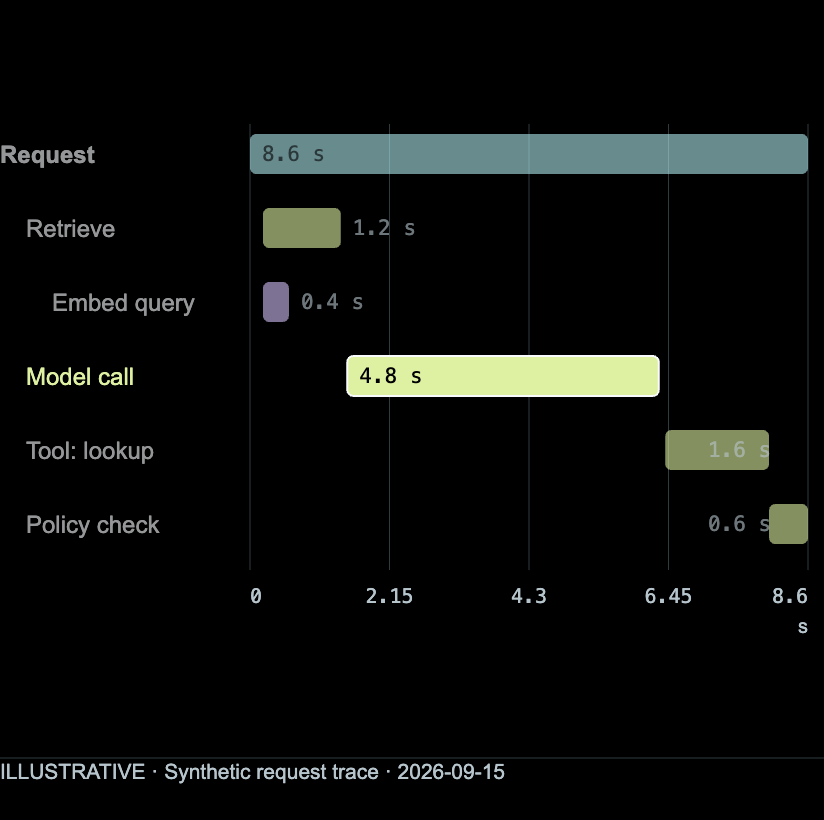

# YouTubeShortCreator

[](https://github.com/andersonkevin/YouTubeShortCreator/actions/workflows/tests.yml)
[](LICENSE)
[](docs/INSTALLATION.md)
[](docs/ARCHITECTURE.md)
[](SECURITY.md)

**A fixed visual system for explainer Shorts on any topic, operated by your assistant, reviewed by you.**

Set up your channel once. For every episode, bring a script, a final voice recording
and thumbnail artwork. Get back a branded 1080x1920 video with word-timed captions,
a cover and a publishing handoff, without redesigning anything. The scenes explain
an idea with a diagram, a chart, a comparison, a list of steps or a code sample;
the subject is up to the channel.

**Version 0.3.0** · **Assistant-operated** · **Local media pipeline** · **macOS production backend** · **MIT**

| Explain the tools | Show the contract | Make approval visible |
| :---: | :---: | :---: |
| <a href="docs/images/prompt-tools.png"></a> | <a href="docs/images/code-policy.png"></a> | <a href="docs/images/approval-gate.png"></a> |

*Actual renders of the fixed template with the illustrative Signal Lab brand, not
editor mockups. [See all 18 layouts](docs/GALLERY.md), including six general-purpose
scenes for any subject.*

## How It Works



Open the folder in your file-capable AI assistant and paste the prompt from
[START-HERE.md](START-HERE.md). The assistant drives the existing local commands;
you are the approval gate at every stage. The production CLI needs no model API
key or server and does not upload media. Your chosen cloud assistant may transmit
prompts and loaded files under its provider settings; local files do not imply
local model inference. See [privacy boundaries](SECURITY.md).

| Stage | You provide | You get back |
| --- | --- | --- |
| Brand | Channel name, colors, logo or a generated wordmark, licensed fonts | A preview image and a hash-locked brand approval |
| Content | A recorded script and a vertical illustration | A recording-bound transcript and word-timed captions |
| Episode | Three or four scenes using the fixed layout slots | A validated episode file with a storyboard that matches the narration |
| Export | A new run ID | 1080x1920 MP4 at 30 fps, up to 3 minutes, with narration and burned-in captions, SRT, JPEG cover |
| Handoff | Your review | YouTube title, description, hashtags, tags, pinned comment and QA evidence |

The approved branding and safe zones stay fixed. Choose different supported
layouts to fit each story; content, timing and artwork change per episode. When
you draft a series, `new --batch NAME` rotates through layouts the batch has not
used yet, and `batch NAME` reports what it has.

## Quick Start

Requirements: Python 3.11+, Node 22+ with npm, local Google Chrome and a compatible
Swift toolchain. The qualified setup is macOS 26 on Apple Silicon.
[Installation details and limits](docs/INSTALLATION.md).

```bash
python3 -m venv .venv
source .venv/bin/activate
python3 -m pip install -r requirements.txt
PLAYWRIGHT_SKIP_BROWSER_DOWNLOAD=1 npm ci --ignore-scripts --no-audit --no-fund
python3 ysc.py
```

The first run asks for your channel, language, audience, tone, scene count, colors,
logo and fonts. Review `workspace/brand/preview.png`, then approve and configure:

```bash
python3 ysc.py brand-approve --approve-write
python3 ysc.py configure --approve-write
python3 ysc.py doctor
```

Dependency installation is an explicit network-enabled step. Runtime commands
never install packages, download speech models or call a voice provider. This is
not a network-isolation guarantee for your assistant, browser or operating system.

## Your First Short

1. Write and record a focused script, or generate the narration locally with the
   optional [voice tool](docs/VOICE.md). Keep the final voice file unchanged.
2. Import the recording and a vertical thumbnail illustration.
3. Transcribe the actual audio, then draft and review the timed captions.
4. Create an episode and replace its example content with your story.
5. Build a preview, render, then watch and listen to the exported MP4.

```bash
python3 ysc.py validate episodes/first-short/episode.json
python3 ysc.py build episodes/first-short/episode.json --run-id preview-01 --approve-write
python3 ysc.py render episodes/first-short/episode.json --run-id final-01 --approve-write
```

The [complete walkthrough](docs/FIRST-SHORT.md) lists every command, expected file
and review checkpoint. Outputs land in `workspace/runs/<episode>/<run-id>/`.
`video.mp4` already contains narration and captions; do not add the audio again in
an editor. The HTML preview is silent by design.

## Visual Library and Asset Expansion

The development tree includes an [opt-in v2 scene adapter](docs/VISUAL-ADAPTER-CONTRACT.md)
for flow, metric and comparison, with [B02 qualification](docs/B02-QUALIFICATION.md).
Eight chart forms, stacked bars and [slide/fade presets](docs/VISUAL-PRESENTATION.md)
have [B03 technical approval](docs/B03-PROGRESS.md). These supported visuals are
separate from the new design-review expansion below.

An [optional FFmpeg backend](docs/MEDIA-BACKENDS.md) is implemented locally;
[B05](docs/B05-PROGRESS.md) records its qualification and pending review.
Native macOS remains the default. [B07](docs/B07-PROGRESS.md) records approved
clean-install technical results. See the [remaining release gates](docs/PIPELINE-ROADMAP.md);
neither the expansion merge nor a successful fixture constitutes a release.

Beyond the 12 production layouts, the development tree includes an
[offline visual library](docs/VISUAL-LIBRARY.md) with 40 icons, six compositions,
eight chart types and three widgets, plus three design-review asset waves that
give a batch of Shorts enough variety that no two episodes look alike. The first
wave leans toward software and AI subjects because that was the first channel;
the data, widget and general-purpose components apply to any subject, and the
palettes, motion recipes and layouts carry no subject at all.

| Wave | What it adds | Read |
| --- | --- | --- |
| 01 | 14 components for AI-programming topics: agent loops, retrieval, validation gates, retries, cache tiers, model routing, API contracts, deployment stages, architecture stacks, annotated code, token budgets, state machines, deltas and traces | [Asset expansion](docs/ASSET-EXPANSION.md) |
| 02 | 55 components across general-purpose forms (quote, checklist, headline figure, before/after, steps, ranking, timeline, pros and cons, definition, cards), widgets, data, systems, AI and software, with a searchable catalog | [Asset library wave 02](docs/ASSET-LIBRARY-WAVE02.md) |
| 03 | 24 generated palettes with contrast rules, 10 deterministic motion recipes and 18 layout studies for the vertical frame | [Asset library wave 03](docs/ASSET-LIBRARY-WAVE03.md) |

Every asset carries a validator, fixtures, browser QA evidence and an in-graphic
provenance line. All of them are studies: discoverable, validated and exportable,
but not yet accepted scene types in the episode contract.

| Agent loop | Retrieval | Validation gate | Request trace |
| :---: | :---: | :---: | :---: |
| <a href="docs/images/expansion-agent-loop.png"></a> | <a href="docs/images/expansion-retrieval.png"></a> | <a href="docs/images/expansion-gate.png"></a> | <a href="docs/images/expansion-trace.png"></a> |

*Exported at the 824x820 production slot with a neutral study palette and an
in-graphic provenance line. All of these are asset studies: discoverable, validated
and exportable, but not yet accepted scene types in the episode contract.*

## Built for Review, Not Autopilot

- Original-file hashes bind transcripts and runs to the selected recording.
- One capture clock drives scenes, progress and captions, so seeking is deterministic.
- Brand, font and implementation changes invalidate the approved setup until requalified.
- Runtime versions are recorded and checked for drift on every run.
- Automated checks cover layout fitting, motion, timed text and source-versus-export audio.
- Every export stays `review_required`. Publishing is a manual decision.

Identical approved inputs and environment reproduce the same layout and capture
state. Byte-identical MP4s across machines are not guaranteed. Speech recognition can
mishear words and timing, so listening and visual review remain part of the workflow.

## Scope

| Included | Not implemented |
| --- | --- |
| Local command-line workflow and file-based authoring | A graphical editor, timeline UI or hosted service |
| Simple local wordmark and monogram generation | AI logo design, trademark clearance or image generation |
| Template-driven diagram, chart, comparison and code scenes | Automatic storyboarding from audio or arbitrary layouts |
| Local speech adapter and imported timed transcripts | Speech-model downloads or cloud fallback |
| Optional offline narration synthesis in a separate environment | Voice-provider accounts, cloned voices or automatic voice approval |
| Native macOS rendering | Qualified Windows or Linux video backends |
| Publishing assets and a source-release archive | YouTube or Canva upload, account access, background agents |

English (US) is the qualified narration language. Other languages need suitable
fonts, local speech support and their own testing. Hashtag checks validate format,
not popularity.

## Verify

```bash
python3 -B -m unittest discover -s tests -v
python3 -B tools/check_docs.py
python3 -B tools/release.py audit
```

[Release qualification](docs/RELEASE-QA.md) records the initial test suite, the
12-layout visual pass and the native media tests with their limits;
[visual-library qualification](docs/VISUAL-LIBRARY-QA.md), the
[asset expansion](docs/ASSET-EXPANSION.md) and the wave [02](docs/ASSET-LIBRARY-WAVE02.md)
and [03](docs/ASSET-LIBRARY-WAVE03.md) libraries record their own observed checks.
The same unit tests, documentation checks and release audit run in GitHub Actions
on every push and pull request.

Keep private work inside `workspace/`, `workspaces/` or outside the repository. The
[release guide](docs/RELEASING.md) explains the allowlisted ZIP and the GitHub review.

## Documentation

| I want to | Read |
| --- | --- |
| Operate it with an assistant | [Start here](START-HERE.md) → [Assistant workflow](docs/ASSISTANT-WORKFLOW.md) |
| Make my first Short | [Installation](docs/INSTALLATION.md) → [First Short](docs/FIRST-SHORT.md) |
| Set up a channel brand | [Branding](docs/BRANDING.md) → [Validation checklist](docs/VALIDATION.md) |
| Pick visuals for an episode | [Visual director](docs/assistant/VISUAL-DIRECTOR.md) → [Visual library](docs/VISUAL-LIBRARY.md) → [Asset expansion](docs/ASSET-EXPANSION.md) → [Wave 02](docs/ASSET-LIBRARY-WAVE02.md) → [Wave 03](docs/ASSET-LIBRARY-WAVE03.md) |
| Generate narration locally | [Local voice synthesis](docs/VOICE.md) |
| Understand or change the engine | [Architecture](docs/ARCHITECTURE.md) → [Data contracts](docs/DATA-CONTRACTS.md) → [Contributing](CONTRIBUTING.md) |
| Fix a blocked command | [CLI reference](docs/CLI.md) → [Troubleshooting](docs/TROUBLESHOOTING.md) |
| Share it publicly | [Licensing](docs/LICENSING.md) → [Release guide](docs/RELEASING.md) |

## License and Asset Rights

Project-authored code, templates and documentation are under the [MIT license](LICENSE).
MIT does not cover imported fonts, recordings, customer logos or dependency binaries;
see the [third-party notices](THIRD_PARTY_NOTICES.md), [image provenance](docs/images/README.md)
and the [licensing guide](docs/LICENSING.md). No fonts, recordings, customer branding,
credentials or machine-specific runtime paths are included in the public source.

---

[Documentation index](docs/README.md) · [Security](SECURITY.md) ·
[Contributing](CONTRIBUTING.md) · [Changelog](CHANGELOG.md)
