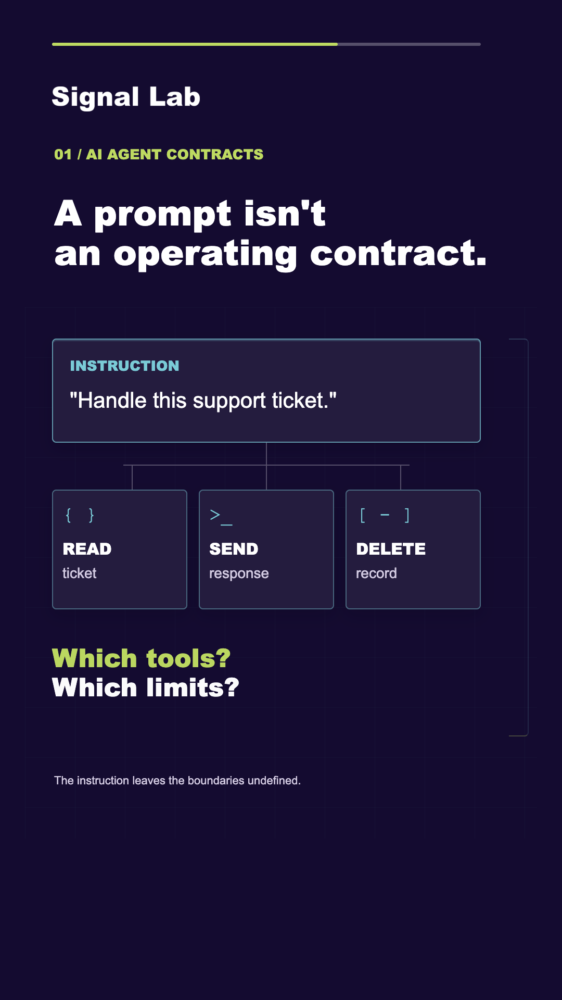
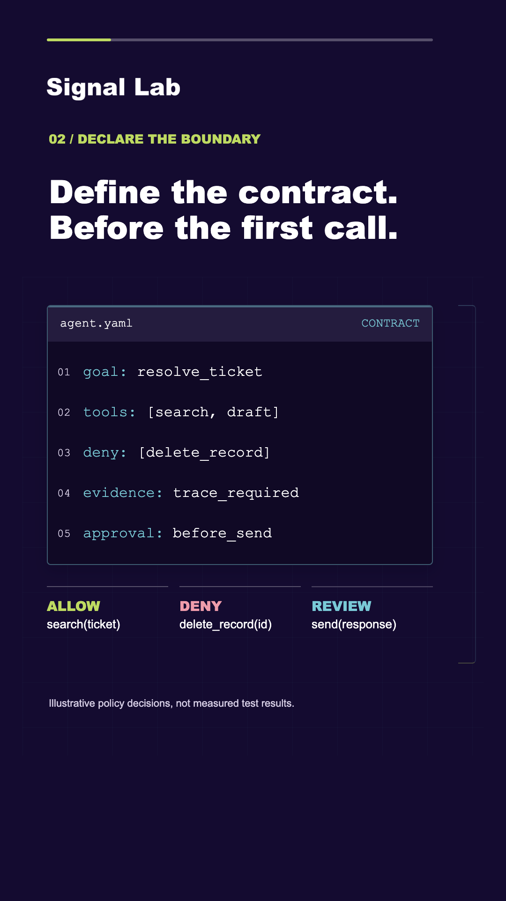
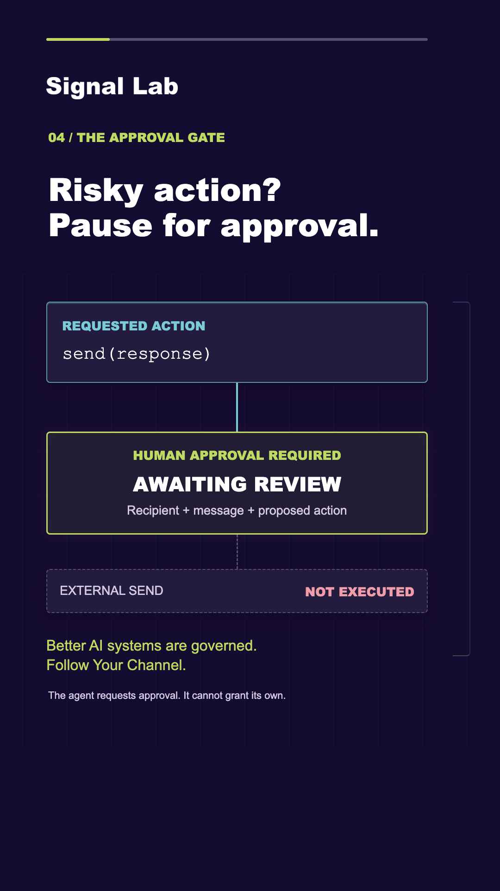

# YouTubeShortCreator

**A consistent visual system for code-and-graphics Shorts. A reviewable workflow for every export.**

Configure your channel once. Bring a script, a final voice recording and thumbnail
artwork. Produce a branded vertical video, timed captions, a cover and a publishing
handoff without rebuilding the design each time.

**Version 0.1.0** · **Assistant-operated workspace** · **macOS production backend** · **MIT project license**

Open this folder in Codex or Claude Code and start with [START-HERE.md](START-HERE.md).
The shared workflow guides branding, production, validation and session handoff.
No model API integration is required; the existing CLI remains available directly.

| Explain the tools | Show the contract | Make approval visible |
| :---: | :---: | :---: |
| <a href="docs/images/prompt-tools.png"></a> | <a href="docs/images/code-policy.png"></a> | <a href="docs/images/approval-gate.png"></a> |

*Actual template renders using the illustrative Signal Lab brand. These are not
mockups of an editor. [Explore all 12 layouts](docs/GALLERY.md).*

## Start Here

- **Working with an assistant:** [Start prompt](START-HERE.md) → [Shared workflow](docs/ASSISTANT-WORKFLOW.md).
- **First-time operator:** [Installation](docs/INSTALLATION.md) → [First Short](docs/FIRST-SHORT.md).
- **Channel owner:** [Branding guide](docs/BRANDING.md) → [Review checklist](docs/VALIDATION.md).
- **Contributor:** [Architecture](docs/ARCHITECTURE.md) → [Contributing](CONTRIBUTING.md).
- **Preparing a public release:** [Licensing](docs/LICENSING.md) → [GitHub handoff](docs/RELEASING.md).
- **Need a command or an error explained?** [CLI reference](docs/CLI.md) · [Troubleshooting](docs/TROUBLESHOOTING.md).

## What You Get

The development tree also includes an [offline visual library](docs/VISUAL-LIBRARY.md):
40 icons, six compositions, eight chart types and three widgets, with structured
discovery for assistants and local SVG/PNG export. These are asset studies, not
new production scene types. See the [pipeline completion gates](docs/PIPELINE-ROADMAP.md).

| Stage | Output |
| --- | --- |
| Brand setup | Guided questions, palette, imported logo or generated wordmark/monogram, local font selection |
| Brand approval | Preview image and a hash-locked approval record |
| Content preparation | Recording-bound transcript, word-timed captions and an editable episode draft |
| Visual production | 12 code/diagram layouts, 3-4 scenes, fixed logo/caption zones and a top progress bar |
| Export | 1080×1920, 30 fps MP4; narration; burned-in captions; SRT; vertical JPEG cover |
| Handoff | YouTube title, description, hashtags, tags, pinned comment and local QA evidence |

The **layout stays fixed**. The **brand changes during onboarding**. The
**story, code, timing and artwork change per episode**.

## Quick Start

Have Python 3.11+, Node 22+ with npm, local Google Chrome and a compatible Swift
toolchain available. The full tested setup is macOS 26 on Apple Silicon.
[Installation details and compatibility limits](docs/INSTALLATION.md).

Run inside this repository:

```bash
python3 -m venv .venv
source .venv/bin/activate
python3 -m pip install -r requirements.txt
PLAYWRIGHT_SKIP_BROWSER_DOWNLOAD=1 npm install --ignore-scripts
python3 ysc.py
```

The first run asks for your channel, language, audience, tone, scene count, colors,
logo and fonts. Review `workspace/brand/preview.png`, then approve and configure:

```bash
python3 ysc.py brand-approve --approve-write
python3 ysc.py configure --approve-write
python3 ysc.py doctor
```

Installation is an explicit network-enabled setup step. Runtime commands do not
install packages, download speech models or call a voice-generation provider.

## Your First Production Run

1. Write and record a focused script. Keep the final voice file unchanged.
2. Import that recording and a vertical thumbnail illustration.
3. Transcribe the actual audio; draft and review timed captions.
4. Create an episode and replace its example content with your story.
5. Build a visual preview, render, then listen to and review the exported MP4.

The [complete first-Short walkthrough](docs/FIRST-SHORT.md) includes every command,
expected file and review checkpoint. Once an episode is prepared:

```bash
python3 ysc.py validate episodes/first-short/episode.json
python3 ysc.py build episodes/first-short/episode.json --run-id preview-01 --approve-write
python3 ysc.py render episodes/first-short/episode.json --run-id final-01 --approve-write
```

The `new` command creates **example AI-agent content**, not a script or graphics
inferred from your recording. Replace it. Removing `DRAFT:` is not editorial approval.

Outputs live in `workspace/runs/<episode>/<run-id>/`. `video.mp4` already contains
narration and captions. Do not add the same audio again in Canva.
The HTML preview is silent; it is not an audio-synchronized player.

## Designed for Consistency, Not Unsupervised Publishing

- Original-file hashes bind transcripts and runs to the selected recording.
- One capture clock controls scenes, progress and captions.
- Brand, font and implementation changes invalidate the approved setup.
- Actual runtime versions are recorded and checked for drift.
- Automated checks cover layout, motion, timed text and source/export audio.
- Every export remains `review_required`; publishing is a manual operator decision.

Identical approved inputs and environment produce repeatable layout and capture
state. **Byte-identical MP4s across machines are not guaranteed.** ASR can mishear
words and timing. Listening and visual review remain part of the workflow.

## Scope and Limits

| Included | Not implemented |
| --- | --- |
| Local command-line workflow and file-based authoring | A graphical editor, timeline UI or hosted service |
| Simple local wordmark/monogram generation | AI logo design, trademark clearance or image-generation integration |
| Template-driven code and diagrams | Automatic storyboarding from audio or arbitrary visual layouts |
| Local speech adapter and imported timed transcripts | Automatic speech-model downloads or cloud fallback |
| Native macOS rendering | Qualified Windows/Linux video backends |
| Publishing assets and a source-release archive | YouTube/Canva upload, account access or background agents |

The full production pipeline has been tested on macOS. English (US) is the
qualified narration language. Other language tags require suitable fonts, local
speech support and separate testing. Hashtag checks do **not** measure popularity.

## Verify and Share

```bash
python3 -B -m unittest discover -s tests -v
python3 -B tools/check_docs.py
python3 -B tools/release.py audit
```

[Qualification evidence](docs/RELEASE-QA.md) records the initial 44-test suite,
12-layout visual pass and native media tests, including their limitations.
Documentation checks are tracked separately.

Keep private work inside `workspace/`, `workspaces/`, or outside the repository.
A custom directory name inside the repo is not automatically private or ignored.
The [release guide](docs/RELEASING.md) explains the allowlisted ZIP and GitHub review.

## License and Asset Rights

Project-authored code, templates and documentation use the [MIT license](LICENSE).
MIT is **not** a license to redistribute imported fonts, recordings, customer
logos or dependency binaries. See [third-party notices](THIRD_PARTY_NOTICES.md),
[asset provenance](docs/images/README.md) and the [licensing guide](docs/LICENSING.md).

No fonts, recordings, customer branding, credentials or machine-specific runtime
configuration are included in the public source archive.

---

[Documentation index](docs/README.md) · [Security](SECURITY.md) ·
[Contributing](CONTRIBUTING.md) · [Changelog](CHANGELOG.md)
