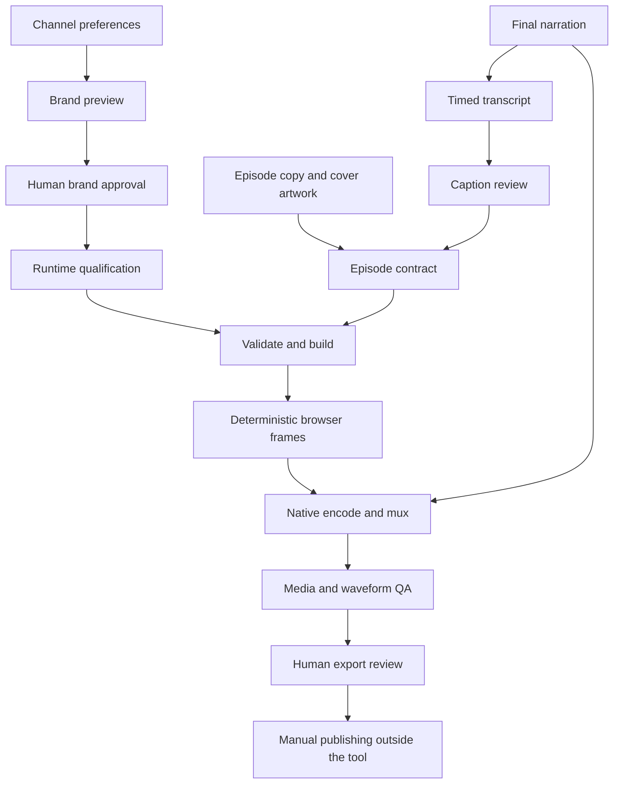

# Architecture

[Docs index](README.md) · [Workflow contracts](WORKFLOW.md) · [Security](../SECURITY.md)

## Design Boundaries

The application separates four concerns: reusable implementation, approved private
branding, per-episode content, and per-run evidence. It is a single-operator local
tool. The Python CLI orchestrates short-lived browser and native subprocesses;
there is no server, queue, database or background agent.



## Modules

| Module | Responsibility | Important boundary |
| --- | --- | --- |
| `ysc.py` | Onboarding, CLI routing, intake, episode draft assembly | Operator input and explicit write flags |
| `branding.py` | Palette/font/logo validation, preview, approval hashes, covers | Private font/assets; fixed geometry |
| `safety.py` | JSON parsing, paths, hashes, exact keys and scalar checks | No duplicate keys, non-finite numbers or contained traversal |
| `runtime.py` | Existing tool discovery, configuration and measured versions | Executables are trusted operator configuration |
| `media_backend.py` | Explicit native dispatch, frame sequence checks and temporary ownership | No episode-selected tools or silent fallback |
| `media_contract.py` | Shared 180-second/5,400-frame Shorts contract and audio storage bound | No automatic narration trimming or unbounded rendering |
| `frame_qa.py` | Cue-boundary sample selection and encoded/reference pixel comparison | Fixed lossy limits; not semantic or human approval |
| `ffmpeg_backend.py` | Fixed optional FFmpeg/ffprobe operations and decoded timestamp checks | Local demuxer/protocol allowlist; no automatic installation |
| `native-capabilities.swift` | H.264 settings and export-preset preflight | Temporary probe only; not a replacement for media QA |
| `workflow.py` | Episode/caption validation, escaped HTML, run orchestration and reports | Inputs cannot supply HTML, CSS or executable commands |
| `visual_adapter.py` | Opt-in v2 widget validation, brand mapping and asset evidence | Known symbols and bounded records only; no raw rendering options |
| `tools/visual_library/options.js` | Shared gallery and production option construction | Production geometry and typography are adapter-owned |
| `capture.mjs` | Headless Chrome, viewport QA, deterministic seeking and PNG capture | Local page with page-level network blocking |
| `chart-qa.mjs` | Chart label bounds and pairwise collision checks | Normalized production pixels; no hidden-label workaround |
| `templates/v1/scenes/` | Eighteen fixed HTML trees and editable text/motion contracts | Only declared slots are variable |
| `templates/v1/assets/` | Scene geometry, design treatment and shared capture clock | Template code, not episode input |
| `transcribe.swift` | Installed Apple speech model and timestamped segments | No model installation or cloud fallback |
| `encode.swift` | 1080x1920 H.264 from captured PNGs at 30 fps | Generated frames only |
| `mux.swift` | Original narration added without speed changes | One video/audio track; duration agreement |
| `media-qa.swift` | Track, size, fps, duration and decoded-frame checks | Media structure, not story quality |
| `decode-audio.swift`, `audio_qa.py` | PCM decoding and source/export comparison | Waveform identity/timing, not ASR correctness |
| `tools/` | Smoke qualification, source packaging, docs QA and lock candidates | Maintenance commands, no remote publishing |

The orchestrator sets the selected workspace for one CLI invocation. These modules
are not a concurrency-safe multi-tenant SDK; do not import them into a shared service
and run different channels concurrently without a separate architecture review.

## Data Layout

```text
YouTubeShortCreator/
  ysc.py                 # operator entry point
  templates/v1/          # reusable, locked implementation
  docs/                  # public documentation and illustrative screenshots
  tests/                 # temporary, synthetic fixtures
  tools/                 # local maintenance utilities
  workspace/             # private, created by onboarding; ignored
    brand/
      brand.json
      approval.json
      preview.png
      assets/            # fonts, logo and generated CSS; private
    runtime.json         # local executable paths and version snapshot
    intake/              # imported recordings/artwork and timed JSON
    episodes/<id>/       # episode contract and copied inputs
    runs/<id>/<run-id>/   # immutable-by-convention render/review outputs
```

## Capture Clock and Reproducibility

`ShortCreatorRenderAt(seconds)` derives scene visibility, reveals, active states,
flow motion, progress and captions from the requested time. A full render samples
`frame / 30`, rather than recording an uncontrolled real-time animation.

Capture resets the film's paint state to avoid history-dependent Chromium shadow
caches. QA seeks backward and returns to the same time, checking identical PNG
hashes within that browser run. This tests capture-state determinism, not universal
pixel parity across different GPUs, fonts, browsers or operating systems.

The implementation lock hashes root Python/JavaScript/Swift files, scene template
assets and the selected visual-library renderer, recipes and pinned vendor bytes.
Docs, maintenance tools and dependencies are not all part of that lock. The brand
approval separately hashes brand files; runtime qualification records
versions, not all executable/dependency bytes. Treat these as drift detectors, not
signed attestations or a fully hermetic build system.

## Writes and Failure Handling

Builds preflight inputs before creating a new run directory. Failed runs are retained
with diagnostic evidence when the orchestrator can write it. The initial import,
onboarding and draft commands can also leave partial files on an unexpected failure;
v0.1.0 does not promise filesystem transactions or automatic rollback.

The shared Python JSON writer serializes first, flushes and fsyncs a same-directory
temporary file, then publishes complete bytes through a no-overwrite hard link.
Serialization, flush or publication failure does not leave a partial target.
Unsupported hard-link filesystems fail rather than fall back to an unsafe write.
This is per-file atomic publication, not an atomic whole-run or power-loss guarantee.
Temporary cleanup failures warn explicitly. Native tool reports use their existing
no-overwrite writers and do not inherit Python's atomic-publication guarantee.

Caught interrupts produce failure evidence when writable; OS kills cannot promise
cleanup or a report. A new successful run hashes nested assets as well as its
top-level deliverables. Older run manifests and approvals are not rewritten.

Temporary frame/PCM/cache directories created by a run are cleaned up by that run.
Original narration and existing successful runs are not automatically removed.
Avoid concurrent edits to source media, branding or template files during production.

## Public and Private Distribution

The source packager uses an explicit allowlist and excludes known private directory
names. It does not publish, inspect Git history or prove that arbitrary allowed text
and images contain no private content. Manual review is still required. Dependency
installation and optional external voice generation are separate operator actions.
