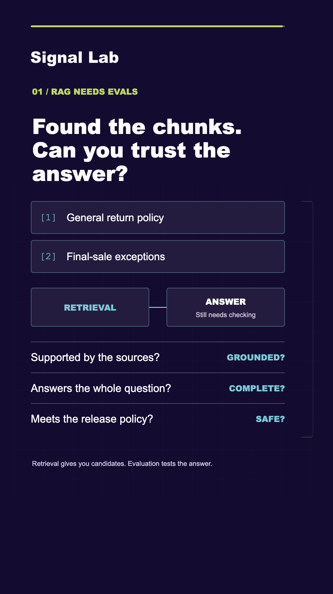
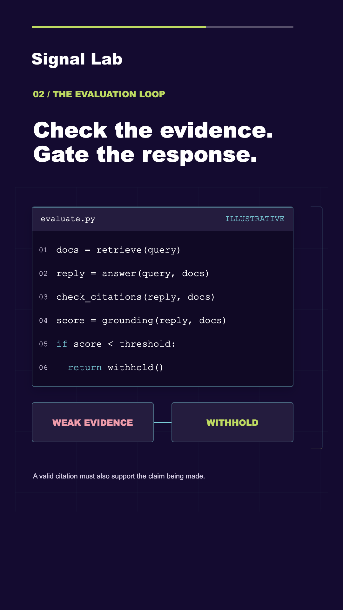
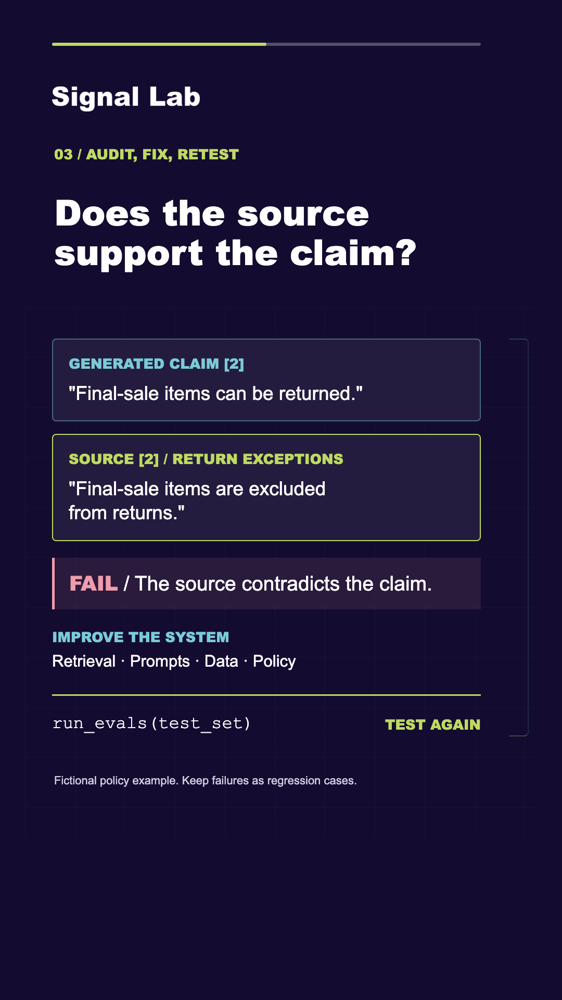
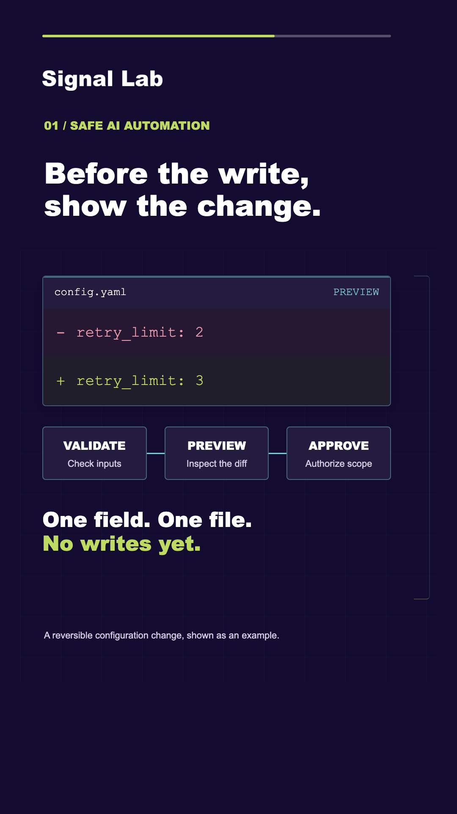
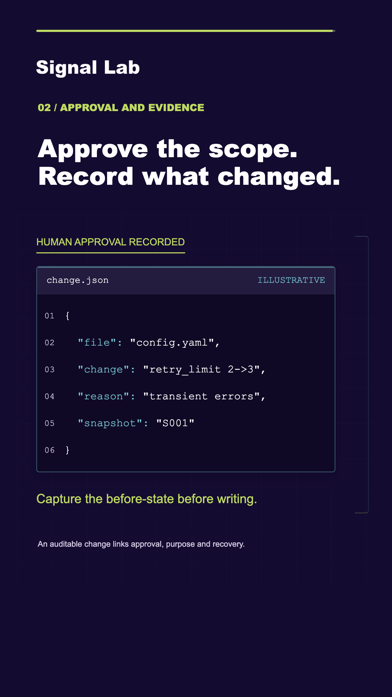
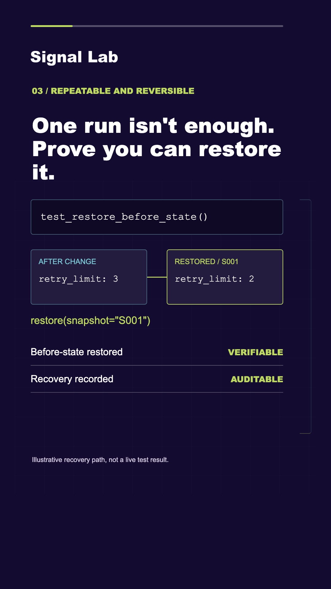
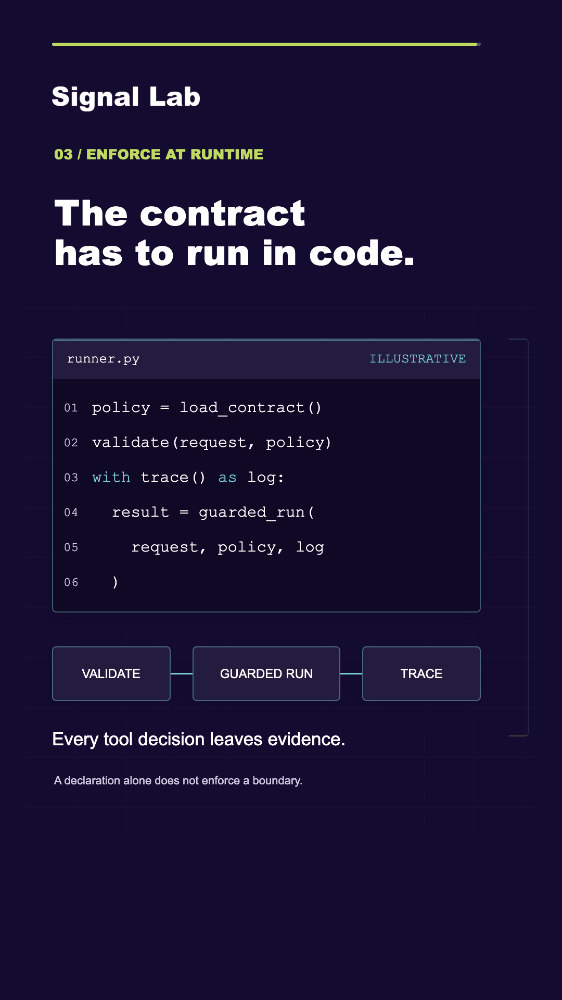
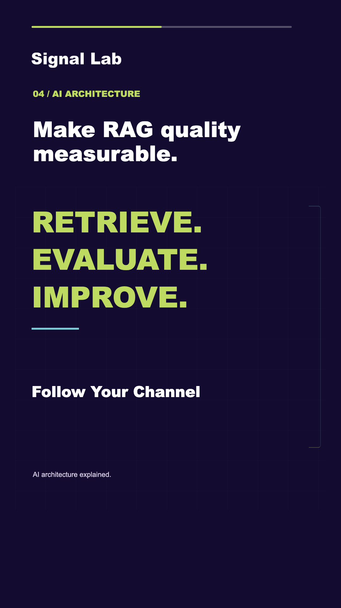
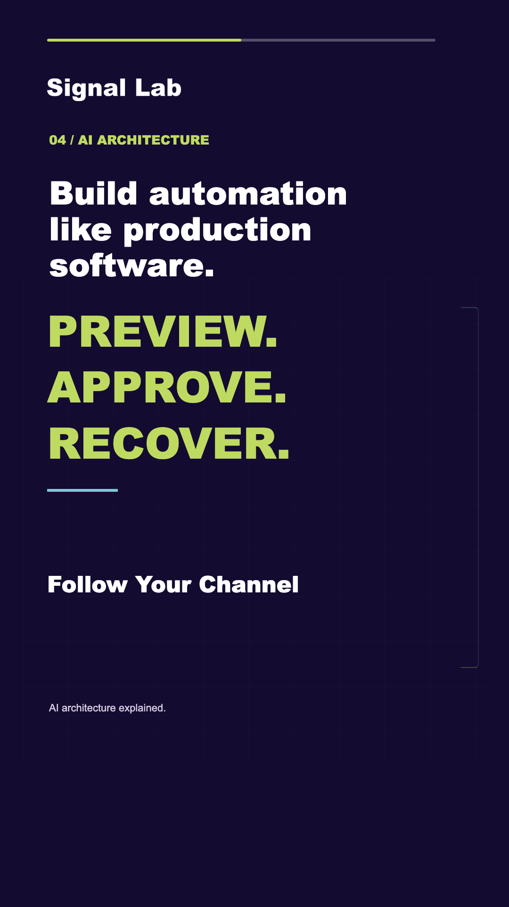

# Template Gallery

[Docs index](README.md) · [Branding](BRANDING.md) · [Data contracts](DATA-CONTRACTS.md)

These are unmodified PNG captures from the local qualification runs, not generated
marketing mockups. The illustrative Signal Lab brand demonstrates the shared visual
system. Colors, logo and fonts come from branding; episode copy and timing remain
editable. Code, values and outcomes in examples are illustrative, not benchmarks.

Screenshots sample different points in a scene, so some timed captions may be absent
during natural cue gaps. They do not demonstrate audio quality or authorize publication.
Click an image to inspect it at 1080x1920.

## Agents and Tool Boundaries

| Prompt and tools | Policy as code | Approval gate |
| :---: | :---: | :---: |
|  |  |  |
| [prompt-tools](../templates/v1/scenes/prompt-tools.json) | [code-policy](../templates/v1/scenes/code-policy.json) | [approval-gate](../templates/v1/scenes/approval-gate.json) |

Use these for a hook, a concrete code contract and a visible control point. Keep
tool names brief; don't shrink typography to accommodate a long API description.

## Retrieval and Evidence

| Retrieval checks | Evaluation code | Evidence comparison |
| :---: | :---: | :---: |
|  |  |  |
| [retrieval-checks](../templates/v1/scenes/retrieval-checks.json) | [code-evaluation](../templates/v1/scenes/code-evaluation.json) | [evidence-comparison](../templates/v1/scenes/evidence-comparison.json) |

Use these when the point is checking evidence rather than merely displaying a model
response. Replace sample figures with sourced values, or label them as illustrative.

## Controlled Automation

| Plan before action | Preview the change | Roll back safely |
| :---: | :---: | :---: |
|  |  |  |
| [automation-plan](../templates/v1/scenes/automation-plan.json) | [automation-preview](../templates/v1/scenes/automation-preview.json) | [automation-rollback](../templates/v1/scenes/automation-rollback.json) |

Use these to explain the relationship between a proposed change, approval, evidence
and recovery. A diagram of a rollback is not implementation of a rollback mechanism.

## Pipelines and Conclusions

| Code pipeline | Concise closing | Automation closing |
| :---: | :---: | :---: |
|  |  |  |
| [code-pipeline](../templates/v1/scenes/code-pipeline.json) | [closing](../templates/v1/scenes/closing.json) | [automation-close](../templates/v1/scenes/automation-close.json) |

Use one clear takeaway. Do not repeat the whole narration in the heading, diagram,
scene note and caption simultaneously.

## Reuse the Contract, Not Just the Picture

Each linked layout JSON contains a fixed `tree`, `content_keys`, `motion_keys` and
an `example`. Use these records to create content; PNGs are documentation, not
editable production templates. Re-run visual QA after any change to text, timing,
fonts or branding. See [image provenance](images/README.md) for hashes and limitations.
