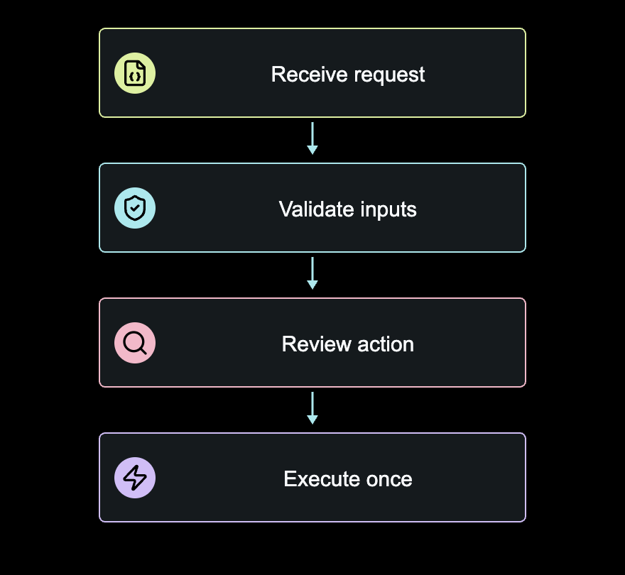

# Visual Library

[Docs index](README.md) | [Visual director](assistant/VISUAL-DIRECTOR.md) | [Pipeline roadmap](PIPELINE-ROADMAP.md)

An offline asset-preparation module for the assistant operating this workspace.
It does not call a model, fetch assets during rendering or modify the approved
video engine. Discovery returns structured JSON, not a model relevance score.



Actual exported asset from the illustrative flow example, not a video-editor mockup.

## Inventory and Readiness

| Collection | Count | Available now |
| --- | --- | --- |
| Lucide icons | 40 | Search, inspect, export SVG with a licensed notice |
| Two-icon compositions | 6 | Fixed concept/state badges; export SVG |
| Data charts | 8 | Validate, preview, scrub, export SVG and 880x810 PNG |
| Widgets | 3 | Process flow, contextual metric and two-column comparison |
| Existing video layouts | 18 | Discover exact content/motion slots and examples |

The catalog has 75 entries, not 75 new video layouts. Icons and compositions are
not company logos. Diagrams/widgets are bounded visual forms, not arbitrary HTML.

The eight charts now have a production adapter under B03 qualification. Flow, metric and comparison also have
an explicit [v2 episode adapter](VISUAL-ADAPTER-CONTRACT.md) qualified in
[B02](B02-QUALIFICATION.md).
Do not inject extra fields into v1 episodes or bypass validation. The original
twelve layouts remain available, using the same capture clock and audio workflow.
Study export and production-scene availability are separate catalog properties;
neither grants editorial or publication approval.

## Discover

```sh
python3 -B tools/visuals.py catalog --kind chart
python3 -B tools/visuals.py catalog --query latency
python3 -B tools/visuals.py describe visual:scatter
python3 -B tools/visuals.py describe layout:code-policy
```

Entries include stable IDs, purpose, limitations, readiness and bounded examples.
Literal query terms must all match; no online search or semantic ranking occurs.
The assistant should inspect `ready_for` before proposing a production use.

## Prepare Privately

Choose an existing private workspace. The following example creates a new one
explicitly and writes only under its `visuals/` directory:

```sh
mkdir -p workspaces/visual-review
python3 -B tools/visuals.py --workspace workspaces/visual-review build demo.json --example --run-id charts-01 --approve-write
python3 -B tools/visuals.py --workspace workspaces/visual-review build widgets.json --example --run-id widgets-01 --approve-write
python3 -B tools/visuals.py --workspace workspaces/visual-review export-svg icon:bot --run-id bot-01 --approve-write
python3 -B tools/visuals.py --workspace workspaces/visual-review export-svg composition:governed-agent --run-id agent-01 --color '#ade8ed' --approve-write
```

Open the resulting `index.html` directly. No server or API key is required.
The study palette is neutral sample styling, not a brand approval or logo.
For your own data, place a JSON file inside the selected workspace and omit
`--example`. Run `validate your-file.json` before `build` with a fresh run ID.
Both built-in examples use invented, visibly labeled teaching data.

Writers reject missing approval, traversal, symlink paths, outputs in public
source directories and existing destinations. A disk failure may leave a partial
run; preserve it and use a new ID. No force/reset/cleanup command is provided.
On macOS, select the canonical workspace path rather than a symlink alias.

## Browser QA and Exports

Use the existing local Node, Playwright module and Chrome executable paths. These
are trusted operator configuration, never values supplied by a dataset. Replace
the placeholders below with paths from your configured runtime:

```sh
node tools/visual_library/qa.mjs workspaces/visual-review charts-01 PLAYWRIGHT_MODULE_PATH CHROME_EXECUTABLE_PATH --approve-write
```

QA creates a new `qa/` directory with three-viewport checks, repeated-seek hashes,
play/pause checks, a gallery screenshot and exports for every visual:

- `<id>.svg`: standalone 880x810 vector visual.
- `<id>-asset.png`: full-resolution 880x810 raster visual.
- `<id>.png`: contextual study screenshot with provenance and editorial copy.
- `<id>.json`: source data, provenance, dimensions, vendor hash and review status.
- `report.json`: measured QA result and exported image hashes.

Keep SVG/PNG assets with their JSON sidecars and the run's third-party notices.
The isolated graphic omits the gallery's source footer; any later video adapter
must display provenance and retain the source declaration. Export is not approval
to publish or evidence of improved retention, reach or revenue.

## Data Constraints

Every visual declares source kind (`illustrative` or `measured`), label, reference
and ISO date. References are inert text; the module does not fetch them. Measured
inputs remain visibly marked `SOURCE REVIEW REQUIRED`. The assistant/operator
must verify the source, permissions, units and interpretation separately.

| Type | Bounds |
| --- | --- |
| Line/bar | Up to six categories, two series, nonnegative values, zero baseline |
| Pie | Up to four slices forming a meaningful whole; positive total |
| Scatter | 3-40 pairs; units required; no constant variables |
| Heatmap | Up to 6x6 percentages, fixed 0-100 scale |
| Correlation | 2-4 variables and 3-40 complete paired observations; fixed -1 to 1 scale |
| Timeline | Up to six start/end intervals; overlaps permitted, not summed |
| Geo | Up to eight fixed-size location markers; no volume encoding |
| Flow | Two to four steps with known icon IDs and short labels |
| Metric | One finite value, unit and context; source still required |
| Comparison | Two columns, up to three short items per column |

Correlation is computed from observations, not supplied as an editorial score.
It is not causation. No missing-data imputation or statistical significance claim
is implemented. Unknown fields, duplicate keys, markup, non-finite values, boolean
numbers and oversized JSON are rejected. Input cannot supply renderer options,
JavaScript, CSS, SVG or URLs to load. Animation reveals fixed values; it does not
invent intermediate measurements.

## Dependencies and Rights

Pinned local assets: Lucide 0.468.0, ECharts 6.0.0 and simplified Natural Earth
5.1.2 geometry. The vendor manifest records file hashes, sources and transformation.
No package install or download occurs during catalog, validation, build or QA.
The source release includes these selected vendor files and notices, but no fonts,
recordings, private branding or dependency executables. See [licensing](LICENSING.md).

Company logos require separate official assets, provenance and operator approval.
Do not fabricate or recolor third-party marks as generic icons.
